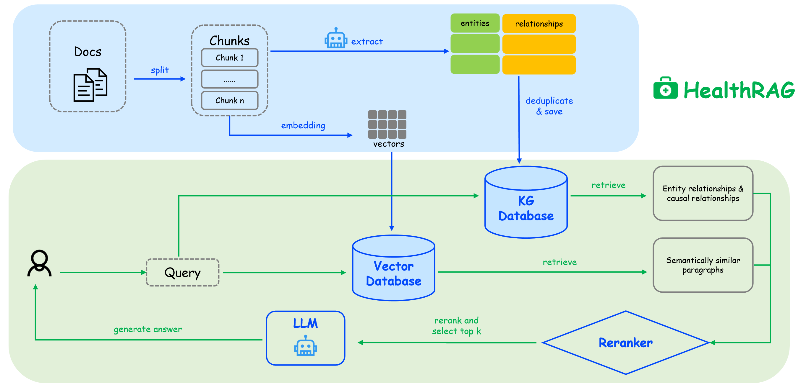
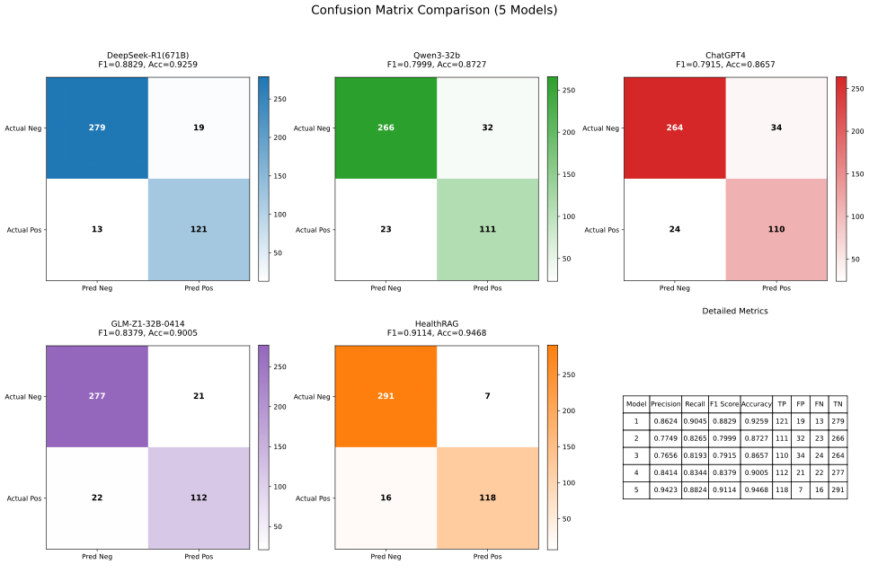

# 💊 HealthRAG

## 🔍Abstract

为提升虚假健康信息的识别能力并提供专业健康指导，本文提出**HealthRAG**——一种基于**大语言模型（LLMs）**和**双路提取技术**的虚假健康信息检测系统，旨在提高不实信息识别的准确性与可信度。该系统使用NetWorkX构建知识图谱，采用**ColbertV2**作为语义检索器进行双路径知识抽取，并以33本专业书籍作为知识库。通过134条正例和298条负例的评测，将HealthRAG与多种先进大语言模型进行对比。所提模型取得了**94.68%**的准确率和**91.14%**的F1值，相较纯大语言模型的最佳基线在F1值上提升了**2.85%**。实验结果充分证明检索增强生成（RAG）技术能有效缓解大语言模型幻觉问题，在虚假健康信息检测领域实现重大突破。

To enhance the identification of false health information and provide professional health guidance, this paper proposes HealthRAG—a false health information detection system based on **Large Language Models** (LLMs) and **dual-path extraction** technology, aiming to improve the accuracy and credibility of misinformation identification. The system constructs a knowledge graph using **NetWorkX** and employs **ColbertV2** as the semantic retriever for dual-path knowledge extraction, utilizing 33 professional books as the knowledge base. Evaluation was conducted using 134 positive and 298 negative examples, comparing HealthRAG against several advanced LLMs. The proposed model achieved an accuracy of **94.68%** and an F1-Score of **91.14%**, representing a **2.85%** improvement in F1-Score over the best-performing LLM-only baseline. The results fully demonstrate that Retrieval-Augmented Generation (RAG) technology effectively mitigates LLM hallucinations, achieving a substantial breakthrough in false health information detection.






## 🚀 Quick Start

### Installation

```bash
# 克隆仓库
git clone https://github.com/rooobeam/HealthRAG)
cd HealthRAG

# 安装依赖
pip install -r requirements.txt
```


## 🤝 Contributing

欢迎通过以下方式参与贡献：
1. 提交 Issue 报告问题或建议
2. Fork 项目并提交 Pull Request


## 📬 Contact

- 作者: [rooobeam](https://github.com/rooobeam), [Rook1eChan](https://github.com/Rook1eChan)
- 项目链接: https://github.com/rooobeam/HealthRAG

